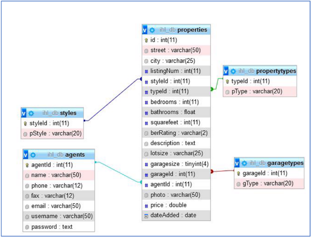
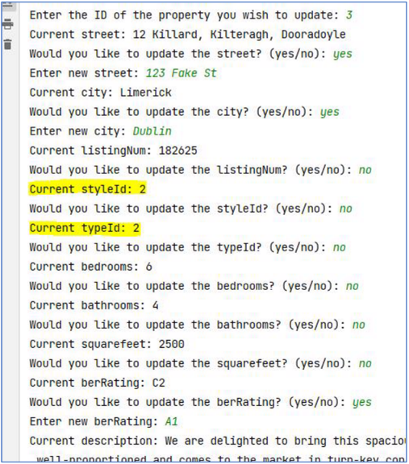
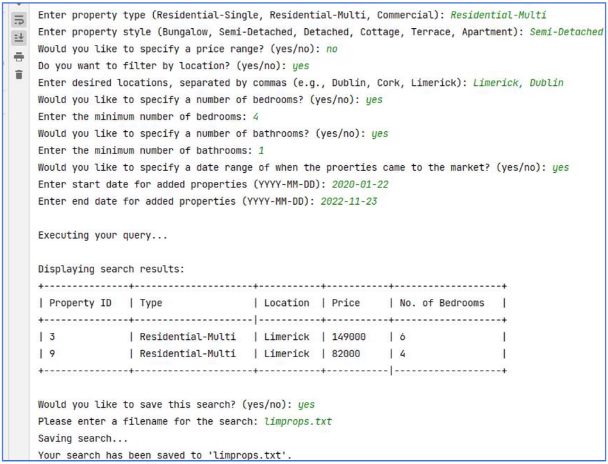
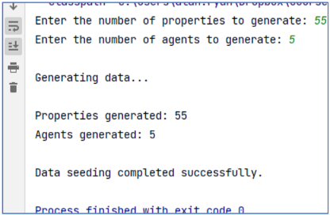
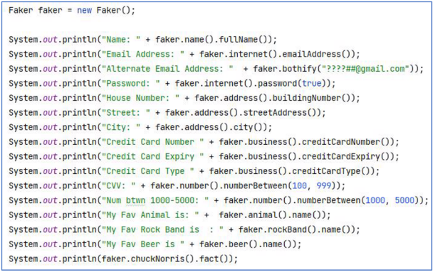
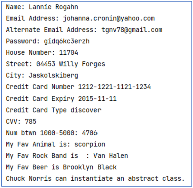
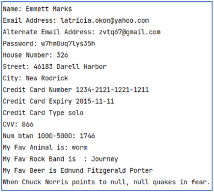

A company called Irish Home Listings (IHL) has recently formed in Limerick and provide a platform for individuals to advertise properties that are for sale across Ireland and includes listings for residential and commercial properties. Their website includes various features like property price statistics, search tools, and photo galleries to assist users in finding suitable properties according to their needs. IHL have developed a complete database (*ihl\_db*) of their properties and their selling agents which underpin the website. The database itself contains 5 tables, the structure of which is outlined below. 

IHL require you to develop an internal command-line application that will afford agents the following: 

1. **Update and Archive(15 Marks).** 

Develop a feature that allows users to archive a property that perhaps has been sold or perhaps has been removed from the market. Also create a feature that will allow a user to update a record for a given property. For example: 

*The screengrab above is just a guide, you can decide on the workflow of this task yourself.  Would it be considered user friendly to ask the user to entera styleId, typeId or agentId?* 

2. **Dynamic Query Building and Generating Report (35 Marks).** 

Develop a feature that allows users to dynamically build an SQL query. The application should prompt the user to select which columns to retrieve, specify filtering conditions, and choose a sorting preference. The application should then construct the SQL query based on user input and execute it against the database. A breakdown of this task is as follows: 

1. Prompt the user to enter the columns they wish to select from the properties table. Allow them to input \* for all columns or specify individual column names separated by commas.  
1. Ask the user if they want to filter the results based on certain conditions (e.g., bedrooms > 3, city = 'Limerick', price >= 350000.00). 
1. Allow for multiple conditions and ensure the application correctly formats them into a WHERE clause with proper logical operators (AND, OR). 
4. Query the user for sorting preferences, including the column to sort by and the order (ASC for ascending, DESC for descending). 
4. Construct the SQL query string based on the inputs, ensuring the proper syntax is maintained (are you going to check for potential SQL injection vulnerabilities? Are you going to sanitise user inputs?). 
4. Execute the constructed query against *ihl\_db* and handle any exceptions or errors that may occur during execution. 
4. Display the query results to the user in a readable format (will pagination be provided?). 
4. Provide the option for the user to save/export the search results to a text file, JSON or CSV. A suggestion here is to use the *Jackson* library for exporting to JSON  and *Apache Commons CSV f*or exporting to CSV. 

*The screengrab above is just a guide, you can decide on the workflow of this task yourself (along with the database search criteria).* 

3. **Database Seeding and Generation (20 Marks).** 

Create a feature that seeds a database with generated data. This data should be structured and coherent, adhering to the schema's constraints, and should be realistic enough for testing purposes. You should allow for various degrees of complexity in data generation, from simple placeholder data to more complex, interrelated data that respects foreign key constraints and other database rules. Seeding data is crucial for creating a representative development and testing environment, allowing developers to simulate real-world scenarios and rigorously test application behaviour, performance, and data integrity without relying on production data. The feature might operate as follows: 

*Again, the screengrab above is just a guide, you can decide on the workflow of this task yourself.* 

For generating and seeding the records, a suggestion is to use[ Java Faker.](https://github.com/DiUS/java-faker) Java Faker uses a variety of datasets to generate plausible values, and it can be localised to generate data appropriate for specific countries or cultures. This means that if you need a Spanish name or address, Java Faker can provide 

data that is typical for that locale (there is currently no support for Ireland   ). A tutorial of the basics can be found[ here.](https://www.baeldung.com/java-faker) 

An example of its use and typical output is as follows: Sample Code: 

Output 1: 

4. **Unique Feature (20 Marks).** 

You must add an additional feature to the application which must complement the existing functionality. 

**Demonstration and Progress Report of Your Work in Class (10%) **

You are required to demonstrate your code weekly in class to me between now and the final submission. 

Failure to demonstrate your work each week will see you forfeit the marks for that demonstration. The demonstrations will take place during your scheduled practical class for the weeks specified below. 

|**Demo** |**Week Beginning** |**Marks** |
| - | - | - |
|**#1** |13/11/2023 |3% |
|**#2** |20/11/2023 |3% |
|**#3** |27/11/2023 (FINAL DEMO) |4% |

**NOTE** 

The deadline for this assignment is 13:00 on Monday, November 27th. I will be using GitHub classroom to manage this assignment and each of you will have your own private repository for this assignment. You are required to commit your work to the repository during your weekly practical class. The reality is that you will more than likely commit much more regularly than that. For each commit that you miss your final mark will be reduced by 5%. 

If you decide to change the structure of the database, then you will need to add the updated script to your commits, otherwise I won’t be in a position to test your application. 

You are required to upload your final deliverable to Moodle as well as GitHub. 

You **must** include a README for your project on Github once it has been completed. 

**Important Notice to All Students Regarding Project Demos **

Students are reminded that during project demonstrations, you may be asked to extend or modify the functionality of the work you present. This is to ensure that you have a deep understanding of your project and its underlying mechanisms. Additionally, be prepared to provide a thorough explanation of any code or component you present as your own. There is an expectancy that you be familiar with every aspect of your project and be able to answer questions related to its implementation, design choices, and functionalities. Your ability to adapt, extend, and explain your work reflects not only on your technical skills but also on your understanding and ownership of the project. Please ensure you are well-prepared for your demos. 
P a g e 7 | 7 
